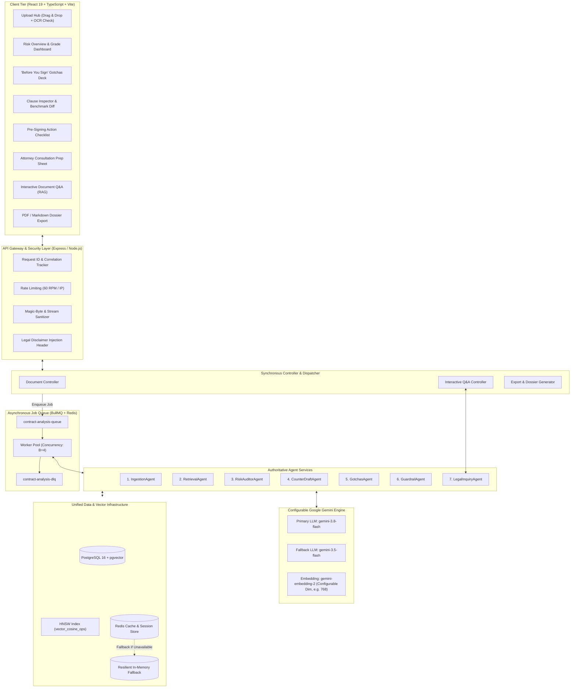

# System Architecture Specification (docs/architecture.md) — Architecture V2

## 1. Executive Summary

The **Legal Intelligence Platform** is an enterprise-grade contract risk auditing, interactive legal document navigation, and educational negotiation strategy platform. It enables non-lawyers (freelancers, small business operators, tenants) to rapidly comprehend complex agreements, detect hidden predatory liabilities, query documents conversationally, and negotiate balanced terms.

Architecture V2 incorporates an authoritative **7-agent topology**, a **BullMQ + Redis asynchronous worker queue**, **hierarchical category-filtered vector retrieval**, **interactive document Q&A**, and an **attorney consultation preparation subsystem**.

---

## 2. High-Level Architecture Diagram



---

## 3. Subsystem Breakdown

### 3.1 Asynchronous Background Queue Architecture (BullMQ + Redis)
To prevent HTTP connection timeouts and avoid tying up the Node.js event loop during multi-clause contract audits:
- **Queue**: `contract-analysis-queue` powered by Redis 7.
- **Job States**:
  - `waiting`: Job queued upon document upload.
  - `active`: Worker picked up job; real-time progress broadcast via `doc:status:<id>`.
  - `completed`: Full audit synthesized, disclaimed, and committed to PostgreSQL.
  - `failed`: Failed job retries up to 3 times with exponential backoff (`initialDelay = 2000ms`, `backoffFactor = 2`).
  - `delayed`: Jobs temporarily throttled under Gemini rate limits (HTTP 429).
- **Dead-Letter Queue (DLQ)**: `contract-analysis-dlq` captures any job that exhausts 3 retries, updating document status to `failed` with diagnostic reason.
- **Transaction Safety**: Workers **never** hold a PostgreSQL transaction open across external LLM API calls. Database writes occur in discrete, fast atomic transactions.

### 3.2 Hierarchical Vector Retrieval Subsystem
To eliminate the false-matching hazards of unconstrained cosine similarity:
1. **Classification**: `RetrievalAgent` identifies the clause's high-level category (e.g. *Indemnification*, *Non-Compete*, *Payment Terms*).
2. **Contract-Family & Jurisdiction Pre-Filter**: Benchmark candidate set is filtered by contract type and jurisdiction (`General Commercial`, `US-General`, `US-CA`, `UK`, `India`).
3. **pgvector HNSW Cosine Search**: Nearest neighbors are queried within the filtered subset:
   ```sql
   SELECT id, title, category, standard_text, plain_explanation,
          1 - (embedding <=> $1::vector) AS cosine_similarity
   FROM benchmark_clauses
   WHERE category = $2 AND jurisdiction = ANY($3::varchar[])
   ORDER BY embedding <=> $1::vector ASC
   LIMIT 3;
   ```
4. **Dynamic Threshold Evaluation**:
   - High-Liability Categories (Indemnity, Liability, Non-Compete): $\tau \ge 0.72$
   - Standard Categories (Confidentiality, Notices, Severability): $\tau \ge 0.65$
   - Below Threshold: Classified as `Benchmark Gap / Novel Clause` and analyzed under novel terms modality.

### 3.3 Interactive Document Q&A Subsystem (`LegalInquiryAgent`)
- Provides conversational RAG over the uploaded contract without triggering full re-auditing.
- User queries are embedded with `task_type: RETRIEVAL_QUERY`.
- Retrieves top-$k$ ($k=4$) most relevant document clauses using clause vectors stored in PostgreSQL.
- Answers are strictly grounded in document facts with exact section citations and follow-up prompts.

### 3.4 Actionable Deliverables Subsystem (`GotchasAgent`)
Generates three high-value actionable outputs beyond raw clause cards:
1. **Top Gotchas Deck**: Prioritized summary of top 3–5 traps translated to plain English.
2. **Pre-Signing Action Checklist**: Operational checklist of ambiguities to verify before signing.
3. **Attorney Consultation Brief**: Structured dossier containing specific questions to ask an attorney.

---

## 4. Centralized Configuration Specification

All runtime parameters are centralized in a single configuration schema (`src/config/env.ts`) and validated at startup using **Zod**. No model names, dimensions, or thresholds are hardcoded in application logic.

```typescript
// Centralized Environment & Runtime Configuration Schema
export const ConfigSchema = z.object({
  // Server & Environment
  PORT: z.coerce.number().default(3000),
  NODE_ENV: z.enum(['development', 'test', 'production']).default('development'),
  
  // Storage
  DATABASE_URL: z.string().url(),
  REDIS_URL: z.string().url().default('redis://localhost:6379'),
  USE_IN_MEMORY_FALLBACK: z.coerce.boolean().default(true),
  
  // AI Models & Capabilities
  GEMINI_API_KEY: z.string().min(10),
  MODEL_REASONING: z.string().default('gemini-3.8-flash'),
  MODEL_REASONING_FALLBACK: z.string().default('gemini-3.5-flash'),
  MODEL_EMBEDDING: z.string().default('gemini-embedding-2'),
  EMBEDDING_DIMENSIONS: z.coerce.number().default(768),
  
  // Retrieval & Scoring Thresholds
  SIMILARITY_THRESHOLD_HIGH_RISK: z.coerce.number().default(0.72),
  SIMILARITY_THRESHOLD_DEFAULT: z.coerce.number().default(0.65),
  RETRIEVAL_TOP_K: z.coerce.number().default(3),
  
  // Pipeline & Queue Constraints
  MAX_FILE_SIZE_MB: z.coerce.number().default(5),
  RATE_LIMIT_RPM: z.coerce.number().default(60),
  ANALYSIS_WORKER_CONCURRENCY: z.coerce.number().default(4),
  ANALYSIS_JOB_MAX_RETRIES: z.coerce.number().default(3)
});
```

---

## 5. Delineation of Information Boundaries

To maintain strict regulatory and cognitive clarity, system outputs always partition information into four distinct tiers:

1. **Document-Derived Facts**: Direct, verbatim excerpts and structural details from the user's uploaded contract.
2. **Retrieved Reference Information**: Published, market-standard benchmark terms and statutory descriptions.
3. **AI Interpretation**: Automated comparative analysis, semantic delta explanations, and educational sample counter-drafts.
4. **Legal Advice**: Explicitly **disclaimed and barred**; users are directed to licensed counsel for binding decisions.
