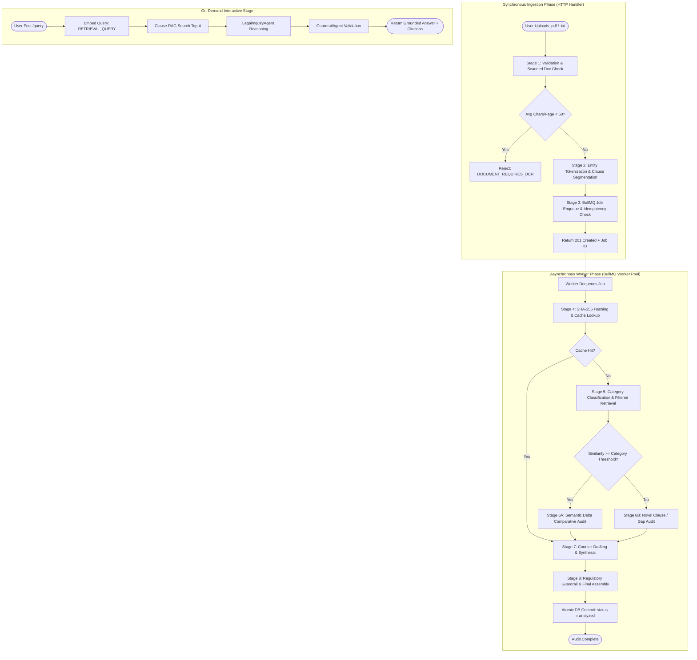

# Document Analysis & Auditing Pipeline (docs/pipeline.md) — Architecture V2

## 1. Authoritative Pipeline Overview

The **Legal Intelligence Pipeline** consists of **8 standardized stages**, cleanly partitioned between a fast synchronous ingestion gate and an asynchronous worker queue powered by **BullMQ + Redis**, alongside an on-demand **Interactive Q&A Stage**.

---

## 2. Stage-by-Stage Operational Specification

### Stage 1: Validation & Scanned Document Check (Synchronous)
- **Execution**: Node.js HTTP Request Handler (`POST /api/documents/upload`).
- **File Validation**:
  - Magic-byte verification: PDF `%PDF-` (`0x25 0x50 0x44 0x46`); Plain Text checked for valid UTF-8/Latin-1.
  - Hard file size limit: **5 MB**.
  - Rate limiting check: 60 requests/minute per IP address.
- **Scanned Document Detection**:
  - Calculate average character count per page: $\text{Density} = \frac{\text{Total Extracted Characters}}{\text{Page Count}}$.
  - If $\text{Density} < 50$, abort processing immediately and return HTTP 422:
    `{"code": "DOCUMENT_REQUIRES_OCR", "message": "This document appears to be an image-only scan. Please upload a digitally created PDF or plain text."}`.

---

### Stage 2: Entity Tokenization & Clause Segmentation (Synchronous)
- **Entity Tokenization**:
  - Extracts party identifiers (e.g. *"Acme Corp"*, *"John Doe"*), contract dates, and governing states.
  - Maps to ephemeral placeholders: `{{PARTY_A}}`, `{{PARTY_B}}`, `{{EFFECTIVE_DATE}}`, `{{STATE}}`.
  - Mapping is retained strictly in an ephemeral in-memory dictionary bound to the `document_id`.
- **Clause Segmentation**:
  - **Pass 1 (Deterministic Regex)**: Matches numbered legal headers (`Section 1.1`, `Article IV`, `12. INDEMNITY`).
  - **Pass 2 (Paragraph Fallback)**: For unstructured prose, groups sentences into coherent paragraphs (150–2,500 chars).
  - Normalizes text via **NFKC**, strips control characters, and generates clause SHA-256 hashes.
- **DB Write**: Document record inserted with `status = 'queued'`, and all parsed clauses saved in a single batch insert.

---

### Stage 3: BullMQ Job Enqueue & Idempotency Check (Synchronous $\rightarrow$ Async Handoff)
- **Job Payload**: `{ documentId, jurisdiction, documentType }`.
- **Job Options**:
  - `jobId`: `job:doc:<document_id>` (guarantees strict per-document idempotency; duplicate jobs are rejected).
  - `attempts`: 3.
  - `backoff`: `{ type: 'exponential', delay: 2000 }`.
- **HTTP Response**: Immediate `201 Created` with document metadata and polling link.

---

### Stage 4: Deterministic Hashing & Redis Cache Verification (Worker)
- **Cache Key**:
  $$\text{Key} = \text{cache:eval:v2}:\langle \text{model\_id} \rangle:\langle \text{prompt\_version} \rangle:\langle \text{benchmark\_hash} \rangle:\langle \text{clause\_sha256} \rangle$$
- **Hit Action**: Direct retrieval of risk tier, deviation summary, and counter-draft from Redis.
- **Miss Action**: Forwards clause to Stage 5.

---

### Stage 5: Category Classification & Filtered Retrieval (Worker)
1. **Clause Classification**: Maps clause to a standard legal category (*Indemnification*, *Limitation of Liability*, *Termination*, *Non-Compete*, *IP Assignment*, *Confidentiality*, *Payment Terms*, *Dispute Resolution*).
2. **Dense Vector Embedding**:
   - Model: Configurable embedding engine (e.g., `gemini-embedding-2`), with configurable dimensions (e.g., 768).
   - Task Type: `RETRIEVAL_DOCUMENT`.
   - Embeddings cached under `cache:emb:v2:<model_id>:RETRIEVAL_DOCUMENT:<text_sha256>`.
3. **Filtered HNSW Retrieval**:
   - Queries `benchmark_clauses` restricted to the identified `category` and `jurisdiction`.
4. **Threshold Branching**:
   - **Similarity $\ge \tau_{\text{category}}$** (0.72 for high-risk categories, 0.65 for standard): Route to **Stage 6A**.
   - **Similarity $< \tau_{\text{category}}$**: Flagged as `Benchmark Gap / Novel Clause`, routed to **Stage 6B**.

---

### Stage 6: Semantic Delta Risk Auditing (Worker)
- **Prompt Injection Defense**:
  - Delimiters in contract text (`</user_contract_clause>`) are escaped.
  - Enclosed in a cryptographic nonce block: `<user_contract_clause nonce="${crypto.randomUUID()}">`.
- **Stage 6A (Benchmark Comparison)**: Gemini evaluates reciprocity, liability caps, and cure periods against the benchmark standard.
- **Stage 6B (Novel Clause Evaluation)**: Gemini evaluates whether unclassified terms introduce unusual obligations or unilateral risks.
- **Output Validation**: Validated via strict Zod schema; classified into `Standard`, `Caution`, or `Unfavorable`.

---

### Stage 7: Counter-Drafting & Synthesis (Worker)
- **Counter-Drafting**: For `Caution` and `Unfavorable` clauses, `CounterDraftAgent` creates balanced, reciprocal substitute clauses labeled as **"Educational Sample Language"**.
- **Entity Reverse Substitution**: Replaces `{{PARTY_A}}` with the original entity names from the Stage 2 in-memory map.
- **Executive Synthesis**: `GotchasAgent` analyzes the complete document and synthesizes:
  1. **Top Gotchas Brief** (top 3–5 risks explained in plain English).
  2. **Pre-Signing Action Checklist** (concrete operational points to verify).
  3. **Attorney Consultation Brief** (specific questions for an attorney).

---

### Stage 8: Regulatory Guardrails & Output Finalization (Worker)
- `GuardrailAgent` scans all synthesized outputs to:
  - Eliminate any prescriptive advice (*"You must sign"*, *"This contract is void"*).
  - Verify that the mandatory legal disclaimer is attached to the final document envelope.
- **Atomic Database Commit**:
  - Updates `documents` table in a fast, discrete transaction:
    `status = 'analyzed'`, `key_findings`, `executive_summary`, token usage counters, and latency.
  - Commits counter-drafts and gotchas.
  - Emits BullMQ completion event.

---

### Interactive Stage: Document Q&A Subsystem (On-Demand)
- **Trigger**: `POST /api/documents/:id/query` with `{ question: string }`.
- **Execution Flow**:
  1. Embed user question using `task_type: RETRIEVAL_QUERY`.
  2. Perform cosine similarity search over `clauses` table for that `document_id`.
  3. Retrieve top-4 most relevant clauses.
  4. Pass retrieved clauses and question to `LegalInquiryAgent` with anti-UPL constraints.
  5. Validate output via `GuardrailAgent` and return answer with section citations.

---

## 3. Resilience, Retries & Dead-Letter Behavior

| Pipeline Failure Event | Worker Handling | Final Fallback State |
| :--- | :--- | :--- |
| **Image-Only Scanned PDF** | Detected in Stage 1 | Immediate 422: `DOCUMENT_REQUIRES_OCR` |
| **Gemini Rate Limit (429)** | Exponential backoff jitter (2s, 4s, 8s) | Delayed job in BullMQ; fallback to cached benchmarks |
| **LLM Output Fails Schema** | Up to 2 immediate retries with repair prompt | Mark clause `Caution (Evaluation Schema Mismatch)` |
| **Database Disconnection** | Reconnect retry | Seamless fallback to in-memory vector cache |
| **Job Exhausts 3 Retries** | Route to `contract-analysis-dlq` | Set document `status = 'failed'` with `error_message` |
